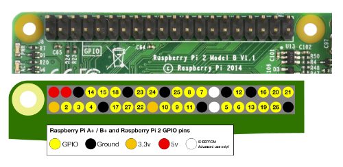

# LPC845 I2C Slave Coprocessor

This projects implements an extensible command parser that you can communicate
with using the I2C0 peripheral block in **slave** mode. It causes the LPC845
to behave similar to most I2C sensors, in that you interact with the
coprocessor via a series of register reads and writes from any standard I2C
master.

### Design Goal

The main purpose of this demo is to enable the use of the low-cost but
relatively high-performance ARM Cortex M0+ LPC845 from NXP as an
affordable real-time co-processor on systems that have no or limited
real time control, such as the Raspberry Pi or other Linux-based
embedded systems.

It can also be used in situations where the main MCU may not have enough pins,
SRAM or peripherals, such as requiring an additional HW UART block with
flow control, or driving a large number of timing-specific peripherals like
NeoPixels.

Since the coprocessor communicates over I2C, multiple devices can be used in
the same system by changing the I2C address accepted by the LPC845.

### Hardware Setup

This demo makes use of two pins for the I2C bus, plus the common GND pin.

You **MAY** also need **two 4.7K pullup resistors**, which are required on
the I2C bus to pull the SCL and SDA pins to logic high (connect the resistor
between SCL and VDD, and SD and VDD). The I2C master (the device you are
connecting the LPC845 to) may or may not have these available. If no pullups
are present, the I2C bus won't work, but you will need to verify this on the
platform you are using as the I2C Master.

| Function | LPC845 Breakout | Notes                                |
|----------|-----------------|--------------------------------------|
| **SCL**  | P0_10 (Pin 23)  | **MAY** require a 4.7K pullup to VDD |
| **SDA**  | P0_11 (Pin 24)  | **MAY** require a 4.7K pullup to VDD |
| **GND**  | GND (Pin 20)    | --                                   |

#### ADC Input (Optional)

The examples later in this readme use the ADC registers on the I2C
co-processor, so you may want to connect the `ADC CH0` to an appropriate
load using the following pin:

| Function | LPC845 Breakout | Notes                                |
|----------|-----------------|--------------------------------------|
| **ADC**  | P0_07 (Pin 32)  | ADC input used by the ADC commands   |


# Architecture

There are two key parts of the LPC845 I2C coprocessor:

* The I2C Slave Engine
* The Command Registry/Parser

## I2C Slave Engine

The I2C0 peripheral is configured as a slave device responding to the address
set in `i2c_cfg.h`:

```
#define I2C_CFG_ADDR_7BIT (0x7EU)
```

The I2C engine has the following logic:

- Continuously Wait for a **START** or **REPEATED START** event to occur.
- Once a **START** or **REPEATED START** even is detected:
    - If this is a **WRITE** request, send the incoming payload to the write
      command handler associated with that register/opcode.
      - Track the last register/opcode written to correlate it with subsequent
        read attempts.
    - If this is a **READ** request, the read command handler associated with the
      specified register/opcode will be fired in the I2C0 slave callback.

## Command Registry/Parser

I2C commands are distinguished by a unique **8-bit opcode** (or 'register'),
and a registry of all of these commands is maintained as a
**singly-linked-list**.

To add commands to the registry, you need to define a unique opcode for the
command, and register the command information via
`cmd_register(struct cmd_record *rec)`, passing in an appropriate
`cmd_record` instance.

> **NOTE:** Because the command registry is implemented as a singly-linked-list,
  commands can be dynamically added or removed at run-time if you need to have
  the flexibility of only making specific commands available in certain
  situations.

### Adding a new Command Handler

You can easily add new commands to the registry using the following steps:

#### 1. Select an opcode

Before you can implement a new command handler, you will need to select a
unique 8-bit opcode or 'register', and add it to `cmd_op_codes.h`. All
opcodes are defined here to avoid any unintentional value overlap.

#### 2. Implement the Read/Write Functions

Read and write functions are mandatory for any command, and use the following
function signatures:

> Note the optional third argument (`void *arg`). This can be used to pass in
a user-defined value, and is provided as a convenience.

```
typedef int (*cmd_write_cb_t)(uint8_t op_code,
		     struct cmd_data *pdata, void *arg);

typedef int (*cmd_read_cb_t)(uint8_t op_code,
		     struct cmd_data *pdata, void *arg);
```

For example, the follow functions are defined for `WHOAMI`:

```
int
cmd_whoami_write_cb(uint8_t op_code, struct cmd_data *pdata, void *arg)
{
	/* This register is read only, ignore any write attempts. */

	return kStatus_Success;
}

int
cmd_whoami_read_cb(uint8_t op_code, struct cmd_data *pdata, void *arg)
{
	if (pdata->len) {
		memset(pdata->payload, 0, pdata->len);
		pdata->payload[0] = CMD_WHOAMI_ID;
	}

	return kStatus_Success;
}
```

#### 3. Register the Command

Once you've selected an op-code, and implemented the read and write functions,
commands can be added to the registry via `cmd_register`, which appends them
to the singly-linked-list.

An example of using this function to register a command is shown in the
following code (which registers the `WHOAMI` command):

```
int
cmd_whoami_init(void)
{
	int rc;

	/* Register cmd with the command registry */
	rc = cmd_register(&cmd_whoami_record);
	if (rc) {
		goto err;
	}

	return kStatus_Success;
err:
	return rc;
}
```

Any time a valid command is received, the I2C engine will traverse the command
registry and if a matching opcode is found, the command's read or write
function will be fired, and appropriate actions can be taken based on the
request packet.

# Default Command Set

The following commands are implemented as a starting point in this application.

> **NOTE:** Opcode values are centrally defined in [source/cmd/cmd_op_codes.h](source/cmd/cmd_op_codes.h).

## General Purpose

### WHOAMI (0x01)

**Read-only**

This command will respond with `0x45` after a read request, and can be used as
a sanity check at system startup to make sure you are talking to the device you
think is connected on the other side.

### VERSION (0x02)

**Read-only**

This command will return an 8-bit value to identify the firmware version on the
co-processor.

This can be useful in situations where future versions of the firmware may be
required to implement breaking changes, or add or remove commands. By checking
the firmware version at startup, these different use cases can be accomodated
on the I2C master side.

## ADC

The 12-bit ADC on the LPC845 is exposed on the coprocessor using ADC_CHAN0,
which corresponds to **`P0_07`** by default.

### ADC_HI (0x11)

**Read-only**

Reading form this register will trigger a new ADC conversion, and return the
upper 4-bits of the 12-bit ADC sample (wrapped in an 8-bit package). The lower
8-bits can then be read via the `ADC_LO` opcode.

> **NOTE**: You should always read the `ADC_HI` register first, since this
  opcode triggers a new ADC conversion.

### ADC_LO (0x12)

**READ-only**

Returns the lower 8-bits of the last 12-bit ADC sample requested.

### ADC_STAT (0x13)

**Read-only**

This 8-bit register provides details on the last ADC conversion, and has the
following format:

| Bit(s)      | Description                       |
|-------------|-----------------------------------|
| 0           | Overrun Flag (1=overrun occurred) |
| 1:4         | ADC Channel (0..7)                |
| 5:7         | Reserved                          |

# Example Code

The `doc/examples` folder contains a number of examples of how to communicate
with the LPC845 coprocessor over I2C using a variety of comman platforms. See
the specific sub-folder(s) for further details.

## Arduino

You can easily connect the LPC845 I2C Co-processor the the Arduino using the
standard I2C pins (SCL and SDA).

### Hardware Setup

You will need to connect SCL on the Arduino to SCL on the LPC845, and SDA on
the Arduino to SDA on the LPC845:

| Func. | Arduino | LPC845 Breakout |
|-------|---------|-----------------|
| SCL   | SCL     | P0_10 (Pin 23)  |
| SDA   | SDA     | P0_11 (Pin 24)  |
| GND   | GND     | GND (Pin 20)    |


There are **no 4.7K pullups on the Arduino by default**, so you will also need
to add two 4.7K (or similar) pullup resistors **between** the following pins:

- SCL and 3.3V (`o SCL ---[ 4.7K ]--- 3.3V o`)
- SDA and 3.3V (`o SDA ---[ 4.7K ]--- 3.3V o`)

### Example Code

Run the following sketch on your Arduino once you have connected the two
boards are described above:

```
#include <Arduino.h>
#include <Wire.h>

#define LPC845_ADDRESS          (0x7E)

#define LPC845_OPCODE_WHOAMI    (0x01)
#define LPC845_OPCODE_VERSION   (0x02)
#define LPC845_OPCODE_ADC_HI    (0x11)
#define LPC845_OPCODE_ADC_LO    (0x12)
#define LPC845_OPCODE_ADC_STAT  (0x13)

/**************************************************************************/
/*!
    @brief  Writes an 8 bit value over I2C
*/
/**************************************************************************/
void write8 (uint8_t opcode, uint32_t value)
{
  Wire.beginTransmission((byte)LPC845_ADDRESS);
  Wire.write(opcode);
  Wire.write(value & 0xFF);
  Wire.endTransmission();
}

/**************************************************************************/
/*!
    @brief  Reads an 8 bit value over I2C
*/
/**************************************************************************/
uint8_t read8(uint8_t opcode, bool stop_cond = false)
{
  Wire.beginTransmission((byte)LPC845_ADDRESS);
  Wire.write(opcode);
  Wire.endTransmission(stop_cond);
  Wire.requestFrom((byte)LPC845_ADDRESS, (byte)1);
  return Wire.read();
}

/**************************************************************************/
/*!
    @brief  Configures the Arduino-compatible board for Serial output at
            115K and I2C master at the default rate (normally 100kHz).
            Also attempts to detect the presence of the LPC845 I2C
            coprocessor via a check to the WHOAMI register.
*/
/**************************************************************************/
void setup()
{
  Serial.begin(115200);

  while (!Serial) {
    delay(1);
  }

  Serial.println("");
  Serial.println("---------------------------");
  Serial.println("LPC845 I2C Coprocessor Test");
  Serial.println("---------------------------");

  pinMode(LED_BUILTIN, OUTPUT);

  Wire.begin();

  /* Make sure we're actually connected */
  uint8_t x = read8(LPC845_OPCODE_WHOAMI);
  if (x != 0x45) {
    Serial.print("Unexpected response from WHOAMI: 0x");
    Serial.println(x, HEX);
    while(1) {
      /* Halt execution here. */
      digitalWrite(LED_BUILTIN, HIGH);
      delay(50);
      digitalWrite(LED_BUILTIN, LOW);
      delay(50);
    }
  }

  /* Check the firmware version */
  x = read8(LPC845_OPCODE_VERSION);
  Serial.print(F("Found LPC845 coprocessor (Firmware: 0x"));
  Serial.print(x, HEX);
  Serial.println(F(")"));
}

/**************************************************************************/
/*!
    @brief  This function will be called continously.
*/
/**************************************************************************/
void loop()
{
  uint8_t  adc_hi = 0;
  uint8_t  adc_lo = 0;
  uint16_t adc = 0;
  uint8_t  adc_stat = 0;

  /* Get an ADC reading from the coprocessor every second. */
  adc_hi = read8(LPC845_OPCODE_ADC_HI);
  adc_lo = read8(LPC845_OPCODE_ADC_LO);
  adc = (uint16_t)(adc_lo | (adc_hi << 8));
  adc_stat = read8(LPC845_OPCODE_ADC_STAT);

  /* Display the results */
  Serial.print("ADC: ");
  Serial.print(adc);
  Serial.print(" (CH: ");
  Serial.print((adc_stat >> 1) & 0xF);
  Serial.print(", Overrun: ");
  Serial.print(adc_stat & 0x1);
  Serial.print(")\n");

  /* Blinky, because ... blinky. */
  digitalWrite(LED_BUILTIN, HIGH);
  delay(500);
  digitalWrite(LED_BUILTIN, LOW);
  delay(500);
}
```

## Raspbery Pi (Python)

The Raspberry Pi contains HW I2C pins and support, meaning that you can
communicate with the LPC845 I2C co-processor by connecting the LPC845 to
the RPi using the **SCL** and **SDA** pins, and send and receive data in
C or Python (or most other languages).

### Hardware Setup

The following pins should be connected.

| Func. | Raspberry Pi              | LPC845 Breakout |
|-------|---------------------------|-----------------|
| SCL   | **3** (See image below)   | P0_10 (Pin 23)  |
| SDA   | **2** (See image below)   | P0_11 (Pin 24)  |
| GND   | GND (Black pins below)    | GND (Pin 20)    |

SCL (3) and SDA (2) **ALREADY HAVE 1.8K pullups to 3.3V**, so no additional
connections or components are required here! The I2C pins can be connected
directly together between the RPi and the LPC845, and the I2C bus will be
automatically pulled high by default.



### Initial Raspberry Pi Setup Notes

If you've setup a new Raspberry Pi using Raspbian, and you don't have it hooked
up to a display or keyboard, you can use a USB serial adapter (FTDI, etc.) and
connect to the TTY UART pins on the RPi:

- **BCM14** (TXD)
- **BCM15** (RXD)

With the cable connected between your desktop and the RPi, you can run a
terminal emulator on your desktop at `115200` baud. For OS X or Linux, for
example, you could use `minicom` (OPT+X to exit!):

```
$ minicom -D /dev/tty.usbserial -b 115200
````

When prompted for a login, the default username and password are

- **Username**: `pi`
- **Password**: `raspberry`.

### Network Access

You will require **network access** for the `apt-get install` commands below.

If you need help setting WiFi up, see [Setting WiFi up via the command line](https://www.raspberrypi.org/documentation/configuration/wireless/wireless-cli.md).

Once network access has been established, the following commands should be run
on the RPi to enable I2C support if it hasn't previously been enabled:

### RPi I2C Prerequisites (Raspbian)

#### 1. Enable I2C on the RPi

Before you can use I2C, you will need to enable it on the device. Run:

```
$ sudo raspi-config
```

Then select `Interfacing Options`,  `I2C`, and select `Yes` when asked
`Would you like the ARM I2C interface to be enabled?`.

#### 2. Install `i2c-tools`
```
$ sudo apt-get install i2c-tools
```

#### 3. Install `python-smbus`

Finally, you should install the `smbus` library for Python if you wish to
access I2C using Python:

```
$ sudo apt-get install python-smbus
```

### Example Code (Python)

The following python code will connect to the LPC845 I2C co-processor and
perform a few basic read and write requests:

```
import sys
import time
import smbus

I2C_BUS = 1

LPC845_I2C_ADDR = 0x7E
LPC845_OPCODE_WHOAMI = 0x01
LPC845_OPCODE_VERSION = 0x02
LPC845_OPCODE_ADC_HI = 0x11
LPC845_OPCODE_ADC_LO = 0x12
LPC845_OPCODE_ADC_STAT = 0x13

# Declare an instance of the I2C bus
bus = smbus.SMBus(I2C_BUS)

# Check the WHOAMI register and read ADC if the co-processor was found
whoami = bus.read_byte_data(LPC845_I2C_ADDR, LPC845_OPCODE_WHOAMI)
if whoami != 0X45:
    print("Unable to find the LPC845 I2C co-processor. Check pullups?")
    sys.exit()

# Read from the ADC every second until program execution stops
while True:
    adc_hi = bus.read_byte_data(LPC845_I2C_ADDR, LPC845_OPCODE_ADC_HI)
    adc_lo = bus.read_byte_data(LPC845_I2C_ADDR, LPC845_OPCODE_ADC_LO)
    adc = adc_hi<<8 | adc_lo
    print("ADC Output: ", adc)
    time.sleep(1.0)
```
